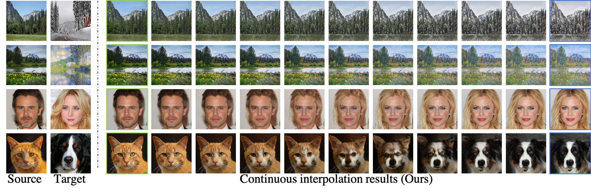

# SAVI2I: Continuous and Diverse Image-to-Image Translation via Signed Attribute Vectors



Pytorch implementation for SAVI2I. We propose a simple yet effective signed attribute vectors (SAV) that facilitates **continuous** translation on **diverse** mapping paths across **multiple** domains. 

## Qualitative Results
### Reference-guided
- Summer2Winter

- Photo2Artwork

- Male2Female

- Female2Male

- AFHQ


## Usage

### Prerequisites
- Python 3.5 or Python 3.6
- Pytorch 0.4.0+


### Install
- Clone this repo:
```
git clone https://github.com/HelenMao/MSGAN.git
```
## Training Examples
Download datasets for each task into the dataset folder
```
mkdir datasets
```

You can download the facades and maps datasets from the BicycleGAN [[Github Project]](https://github.com/junyanz/BicycleGAN). <br>
We employ the network architecture of the BicycleGAN and follow the training process of Pix2Pix.
```
cd MSGAN/Pix2Pix-Mode-Seeking
python train.py --dataroot ./datasets/facades
```
- Unpaired Data: Yosemite (summer <-> winter) and Cat2Dog (cat <-> dog)
- Baseline: DRIT <br>

You can download the datasets from the DRIT [[Github Project]](https://github.com/HsinYingLee/DRIT). <br>
Specify `--concat 0` for Cat2Dog to handle large shape variation translation
```
cd MSGAN/DRIT-Mode-Seeking
python train.py --dataroot ./datasets/cat2dog
```
### Conditioned on Text
- Dataset: CUB-200-2011
- Baseline: StackGAN++ <br>

You can download the datasets from the StackGAN++ [[Github Project]](https://github.com/hanzhanggit/StackGAN-v2).
```
cd MSGAN/StackGAN++-Mode-Seeking
python main.py --cfg cfg/birds_3stages.yml
```
## Pre-trained Models


Download and save them into 
```
./models/
```

## Evaluation
For [Pix2Pix](https://github.com/junyanz/BicycleGAN), [DRIT](https://github.com/HsinYingLee/DRIT), and [StackGAN++](https://github.com/hanzhanggit/StackGAN-v2), please follow the instructions of corresponding github projects of the baseline frameworks for more evaluation details. <br>
### Testing Examples
**DCGAN-Mode-Seeking** <br>
```
python test.py --dataroot ./datasets/Cifar10 --resume ./models/DCGAN-Mode-Seeking/00199.pth
```
**Pix2Pix-Mode-Seeking** <br>
```
python test.py --dataroot ./datasets/facades --checkpoints_dir ./models/Pix2Pix-Mode-Seeking/facades --epoch 400
```
```
python test.py --dataroot ./datasets/maps --checkpoints_dir ./models/Pix2Pix-Mode-Seeking/maps --epoch 400
```
**DRIT-Mode-Seeking** <br>
```
python test.py --dataroot ./datasets/yosemite --resume ./models/DRIT-Mode-Seeking/yosemite/01200.pth --concat 1
```
```
python test.py --dataroot ./datasets/cat2dog --resume ./models/DRIT-Mode-Seeking/cat2dog/01999.pth --concat 0
```
**StackGAN++-Mode-Seeking** <br>
```
python main.py --cfg cfg/eval_birds.yml 
```
