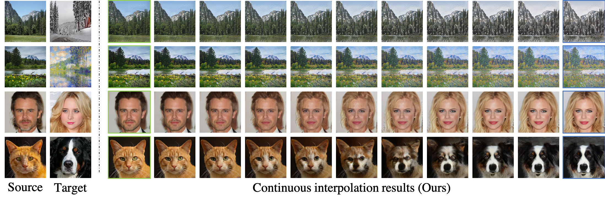

# SAVI2I: Continuous and Diverse Image-to-Image Translation via Signed Attribute Vectors



Pytorch implementation for SAVI2I. We propose a simple yet effective signed attribute vector (SAV) that facilitates **continuous** translation on **diverse** mapping paths across **multiple** domains. 

## Qualitative Results
### Reference-guided
- Summer2Winter


- Winter2Summer


- Photo2Artworks (Monet,  Van Gogh and Ukiyo-e)


- Male2Female


- Cat2Dog


- Cat2Wildlife


- Dog2Cat


### Latent-guided

- Female2Male


- Wildlife2Cat


- Wildlife2Dog


## Comparisons with the state-of-the-arts
### Reference-guided
From left-to-right: [StarGAN-v2](https://github.com/clovaai/stargan-v2), [HomoInterpGAN](https://github.com/yingcong/HomoInterpGAN), [FUNIT](https://github.com/NVlabs/FUNIT), Ours
- male2female

-female2male


### Latent-guided
From left-to-right: [StarGAN-v2](https://github.com/clovaai/stargan-v2), [DLOW](https://github.com/ETHRuiGong/DLOW), [RelGAN](https://github.com/willylulu/RelGAN), [Fader Networks](https://github.com/facebookresearch/FaderNetworks), Ours
- male2female

-female2male


## Usage

### Prerequisites
- Python 3.5 or Python 3.6
- Pytorch 0.4.0+


### Install
- Clone this repo:
```
git clone https://github.com/HelenMao/SAVI2I.git
```
## Training Datasets
Download datasets for each task into the dataset folder
```
mkdir datasets
```
- Yosemite  (summer <-> winter) 
- Photo2Artworks (Photo, Monet, Van Gogh and Ukiyo-e) <br>
You can follow the instructions of [CycleGAN datasets](https://github.com/junyanz/pytorch-CycleGAN-and-pix2pix/blob/master/docs/datasets.md) to download Yosemite and Photo2Artworks datasets.

- CelebA-HQ (Male  <-> Female)  <br> 
We split CelebA-HQ into male and female domains according to the annotated label and fine-tune the images manaully. 
- [AFHQ](https://github.com/clovaai/stargan-v2/blob/master/README.md#animal-faces-hq-dataset-afhq)  (Cat, Dog and WildLife)

## Training
- Yosemite
```
python train.py --dataroot ./datasets/Yosemite/ --phase train --type 1 --name yosemite --n_ep 700 --n_ep_decay 500 --lambda_r1 10 --lambda_mmd 1 --num_domains 2
```
- Photo2Artworks
```
python train.py --dataroot ./datasets/Photo2Artworks/ --phase train --type 1 --name photo2artworks --n_ep 100 --n_ep_decay 0 --lambda_r1 10 --lambda_mmd 1 --num_domains 4
```
- CelebAHQ
```
python train.py --dataroot ./datasets/CelebAHQ/ --phase train --type 0 --name celebAHQ --n_ep 30 --n_ep_decay 0 --lambda_r1 1 --lambda_mmd 1 --num_domains 2
```
- AFHQ
```
python train.py --dataroot ./datasets/AFHQ/ --phase train --type 0 --name AFHQ --n_ep 100 --n_ep_decay 0 --lambda_r1 1 --lambda_mmd 10 --num_domains 3
```


## Pre-trained Models
- [Yosemite](https://drive.google.com/open?id=1eWq1nD-zJVEerru-_X5Ztpb8YbcYo7Px) 
- [Photo2Artworks](https://drive.google.com/open?id=1ZXnh090MFMrw8iSMjk5zvqXYY_nMmCoU)
- [CelebAHQ](https://drive.google.com/open?id=1jLZHhWjxz_JyszU1_hj39l3_8zU9Hfkw)
- [AFHQ](https://drive.google.com/open?id=1tnDDolN-OMLG4BUNB6rPIjSXoP2FbXgw)

Download and save them into 
```
./models/

```

## Testing 
**Reference-guided**
```
python test_reference_save.py --dataroot ./datasets/CelebAHQ --resume ./models/CelebAHQ/00029.pth --phase test --type 0 --num_domains 2 --index_s A --index_t B --num 5 --name CelebAHQ_ref  
```
**Latent-guided** 
```
python test_latent_rdm_save.py --dataroot ./datasets/CelebAHQ --resume ./models/CelebAHQ/00029.pth --phase test --type 0 --num_domains 2 --index_s A --index_t B --num 5 --name CelebAHQ_rdm  
```

## Acknowledgement
Network architectures inspired from: <br>
- [DRIT++](https://github.com/HsinYingLee/MDMM)
- [StarGAN-v2](https://github.com/clovaai/stargan-v2)

